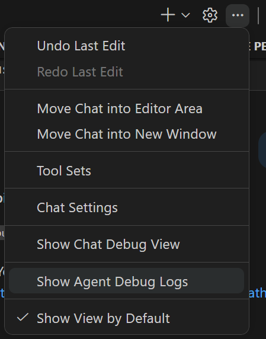

# Acceptance Criteria

## Modernization Hackathon — Acceptance Criteria

Participants must build their own **agent, skills, and/or MCP server** that can modernize this Legacy Inventory API to .NET 10 — **in a single prompt** — using the **fewest tokens possible**.

> ⚡ **One Prompt Rule**: You bring **one prompt** to use with your agent. When you hit send, your agent must complete the entire modernization autonomously — no follow-ups, no corrections, no multi-turn conversations. If it fails or partially completes, that's your final result.

---

## 🎯 What You Must Deliver

### 1. A Working Modernization Toolchain

You must bring your own:
- **Custom Agent** (GitHub Copilot Extension, custom coding agent, etc.)
- **Custom Skills / Prompt Files** (reusable instructions that guide the modernization)
- **MCP Server** (optional but can be helpful — e.g., for .NET upgrade knowledge, package resolution, etc.)

### 2. A Single-Prompt Modernization

Your toolchain must modernize this API from .NET 7 → .NET 10 when triggered by a single user prompt. No manual follow-ups, no corrections, no multi-turn conversations.

---

## ✅ Modernization Requirements

The modernized API must meet ALL of the following:

| # | Requirement | Validation |
|---|-------------|------------|
| 1 | Targets `net10.0` | `grep "net10.0" src/**/*.csproj` |
| 2 | Builds successfully | `dotnet build` exits 0 |
| 3 | Runs and responds | `curl http://localhost:5150/api/products` returns 200 |
| 4 | `Startup.cs` removed, minimal hosting used | No `Startup.cs` file exists |
| 5 | `Newtonsoft.Json` removed, `System.Text.Json` used | `grep -r "Newtonsoft" src/` returns nothing |
| 6 | `Swashbuckle` removed, built-in OpenAPI used | `grep -r "Swashbuckle" src/` returns nothing |
| 7 | All endpoints return same response shapes & status codes | Manual or automated endpoint comparison |
| 8 | Modern C# (file-scoped namespaces, primary constructors) | Code review |
| 9 | Real async I/O in repositories | No `Task.FromResult` wrapping sync code |

---

## 🏅 Scoring: Completeness × Efficiency

**The winner completes the most requirements using the fewest tokens.**

### Formula

```
Score = (Completed Requirements × 10) − (Total Tokens ÷ 1,000)
```

| 9/9 requirements, 12K tokens | → 90 − 12 = **78** ← Best |
|-------------------------------|---------------------------|
| 9/9 requirements, 45K tokens | → 90 − 45 = **45** |
| 7/9 requirements, 8K tokens | → 70 − 8 = **62** |

**Ties broken by**: fewer LLM round-trips, then simpler toolchain setup.

---

## 📊 Proof of Token Usage — Required

Every submission **must include proof** of token consumption in a `PROOF.md` file.

### How to Capture Token Usage in GitHub Copilot (VS Code)

#### Method 1: Agent Debug Log Panel (Recommended — Most Complete)

This gives you a full session summary with total token usage, tool calls, and duration.

**Setup (do this before starting your modernization):**
1. Open VS Code Settings (`Ctrl+,`)
2. Search for `agentDebugLog`
3. Enable **`github.copilot.chat.agentDebugLog.fileLogging.enabled`**
4. Also ensure **`github.copilot.chat.agentDebugLog.enabled`** is on

> ℹ️ These settings are already pre-configured in this repo's `.vscode/settings.json`

**After your modernization prompt completes:**
1. In the Chat view, click `...` menu → **Show Agent Debug Logs**

   

2. Click the **session description in the breadcrumb bar** at the top → opens the **Summary view**
3. The Summary shows: **total token usage**, tool calls count, error count, and duration
4. To export: click the **Export (download) icon** in the top-right toolbar
   - Saves as an **OpenTelemetry JSON (OTLP format)** file — include this in your PR

**Where logs are stored on disk:**

| OS | Path |
|----|------|
| **Windows** | `%APPDATA%\Code\User\globalStorage\github.copilot-chat\agent-traces.db` |
| **macOS** | `~/Library/Application Support/Code/User/globalStorage/github.copilot-chat/agent-traces.db` |
| **Linux** | `~/.config/Code/User/globalStorage/github.copilot-chat/agent-traces.db` |

This is a SQLite database containing all debug sessions. Use the **Export** button in the Agent Debug Log panel to get a portable OTLP JSON file for your submission.

#### Method 2: Context Window Indicator (Quick Visual Proof)

The chat input box has a **context window indicator** (shaded bar):
- **Hover over it** to see exact token count as a fraction (e.g., `47K / 128K`)
- Shows breakdown by category (system prompt, conversation history, tool results, etc.)
- Screenshot this after your prompt completes as supplemental proof

#### Method 3: Ask Copilot Directly (Mid-Session)

With `agentDebugLog.enabled` turned on, you can type:
```
/troubleshoot how many tokens did you use in #session
```

#### Method 4: Historical Analysis

After your session, you can run:
```
/chronicle:cost-tips
```
This analyzes recent sessions for token usage patterns. Requires `github.copilot.chat.localIndex.enabled` to be `true` (default).

---

### For Custom Agents / MCP Servers / Direct API Calls

If your toolchain calls an LLM API directly, include the raw `usage` response fields:
```json
{
  "usage": {
    "prompt_tokens": 8500,
    "completion_tokens": 3200,
    "total_tokens": 11700
  }
}
```
Sum all API calls for your total.

---

### PROOF.md Must Contain

1. **Total tokens used** (input + output combined)
2. **Number of LLM round-trips** (how many model invocations)
3. **Evidence** — one or more of:
   - Exported OTLP JSON from Agent Debug Log panel
   - Screenshot of the Summary view showing token totals
   - Screenshot of context window indicator hover tooltip
   - Raw API response `usage` fields (if using direct LLM calls)
4. **Toolchain description** — what agent/skill/MCP you built and how it minimizes tokens

---

## ✅ Validation Script

```bash
# Build
dotnet build src/LegacyInventoryApi

# Run
dotnet run --project src/LegacyInventoryApi &
sleep 3

# Verify endpoints
curl -sf http://localhost:5150/api/products | jq '.success'        # true
curl -sf http://localhost:5150/api/categories | jq '.success'      # true
curl -sf http://localhost:5150/api/products/1 | jq '.data.name'    # "Wireless Mouse"
curl -sf http://localhost:5150/openapi/v1.json | jq '.info'        # OpenAPI info

# Verify legacy deps removed
grep -r "Newtonsoft" src/ && echo "❌ FAIL" || echo "✅ PASS"
grep -r "Swashbuckle" src/ && echo "❌ FAIL" || echo "✅ PASS"
grep -r "net7.0" src/ && echo "❌ FAIL" || echo "✅ PASS"
grep -r "Startup" src/ && echo "❌ FAIL" || echo "✅ PASS"
```

---

## 📝 Submission

Open a PR with:
- [ ] Modernized code (the result of your single prompt)
- [ ] `PROMPT.md` — the exact prompt you used
- [ ] `PROOF.md` — token usage evidence (see above)
- [ ] `.github/agents/` or `.github/skills/` or `mcp/` — your custom toolchain source code
- [ ] Brief PR description of your approach
